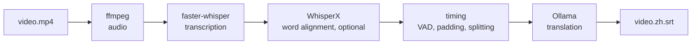

# subtitle-forge

[](LICENSE)

Local-first CLI and HTTP pipeline that transcribes video with faster-whisper and translates subtitles via Ollama

English | [简体中文](README.zh-CN.md)

Give it a video file and it transcribes the subtitles, then translates them into
the language you specify. What I set out to build is a scriptable pipeline for
producing subtitles in bulk, and unless you point Ollama at another machine,
none of your media or subtitle content leaves this one. The CLI and the HTTP
service run the same code; the service just puts a job queue in front of it.



## Install

Not published on PyPI; install from source. Prerequisites: Python 3.9+, `ffmpeg`
on PATH, and a running Ollama.

```bash
git clone https://github.com/Lynthar/subtitle-forge.git
cd subtitle-forge
pip install -e .
```

Two extras worth having:

```bash
pip install -e '.[whisperx]'   # word-level forced alignment
pip install -e '.[serve]'      # the HTTP service
```

An NVIDIA GPU is not required, but it makes a big difference.

## Usage

Run this first: it checks ffmpeg, Ollama and your GPU, and downloads the models.

```bash
subtitle-forge quickstart
```

Then:

```bash
subtitle-forge process video.mp4 -t zh
subtitle-forge process video.mp4 -t zh -t ja --bilingual
subtitle-forge batch ./videos/ -t zh --recursive -w 2
subtitle-forge transcribe video.mp4              # transcription only
subtitle-forge translate video.en.srt -t zh      # translate an existing SRT
subtitle-forge serve --host 127.0.0.1 --port 8765
```

Output files go in the same directory as the source: `{name}.{lang}.srt`, or
`{name}.{source}-{target}.srt` for bilingual. Translation uses ten built-in
prompt templates. `batch` processes a directory, optionally recursively, with a
worker count you set.

`serve` binds to `127.0.0.1` and expects a bearer token — generate one with
`openssl rand -hex 32` and pass it as `SUBTITLE_FORGE_TOKEN`. The token travels
over plain HTTP, so put TLS in front if you move that binding off loopback. Also
treat it as equivalent to filesystem access: anyone holding it can ask the
service to read any path the process can read. `--no-auth` exists for
single-user local runs and only warns when used off loopback.

## Configuration

`~/.config/subtitle-forge/config.yaml`, created on first run. The keys you're
likely to change:

| Key | Default |
|---|---|
| `whisper.model` | `large-v3` |
| `whisper.device` / `compute_type` | `cuda` / `float16` |
| `whisper.use_whisperx` | `true` |
| `ollama.model` | `qwen2.5:14b` |
| `ollama.host` | `http://localhost:11434` |
| `timestamp.mode` | `minimal` |
| `max_workers` | `2` |

`config/default.yaml` in the repository is a commented reference copy — it isn't
read at runtime.

## Limitations

- **SRT output only** — no WebVTT, ASS or TTML.
- **Translation needs Ollama.** Without it you can still `transcribe`, but that's
  as far as it goes: translation has no cloud fallback and no bundled model.
- **Whisper's 99 languages refer to transcription.** Translation has proper
  language names for fourteen; anything else gets passed to the model as a bare
  language code.
- **It picks the audio track by channel count**, so a file with a 2.0 main track
  and a 5.1 commentary track can end up transcribing the commentary. There's no
  `--audio-track` flag yet.
- **When forced alignment fails it falls back quietly** — you get segment-level
  timestamps and a warning in the log, not an error.
- **The HTTP service keeps its job queue in memory.** Restarting loses the queue,
  and there's no per-job cancel or real progress percentage.

## Documentation

- [User guide](docs/user-guide.md) — installation per platform, every option,
  privacy and network boundaries, troubleshooting. Written in Chinese.

## License

GNU Affero General Public License v3.0 only — see [LICENSE](LICENSE).
Copyright (c) 2026 Lynthar.

This project depends on [pysrt](https://pypi.org/project/pysrt/), which is
GPLv3; the AGPLv3 of the combined work is what you receive it under.
