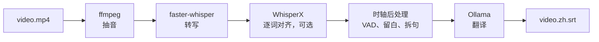

# subtitle-forge

[](LICENSE)

本地优先的视频字幕流水线：faster-whisper 转写 + Ollama 本地大模型翻译，CLI 与 HTTP 服务同源

[English](README.md) | 简体中文

给它一个视频文件，它转写出字幕，再翻译成你指定的语言。我计划的是一条能脚本化的自动
批量字幕生产流水线，并且除非你把 Ollama 的地址指向另一台机器，否则你的音视频和字幕
内容都不会离开本地。CLI 和 HTTP 服务跑的是同一份代码，服务端只是在前面加了一个任务
队列。



## 安装

**没有发布到 PyPI**，需要从源码安装。前置条件：Python 3.9+、PATH 里有 `ffmpeg`、以及
一个正在运行的 Ollama。

```bash
git clone https://github.com/Lynthar/subtitle-forge.git
cd subtitle-forge
pip install -e .
```

两个值得装的可选组件：

```bash
pip install -e '.[whisperx]'   # 逐词强制对齐
pip install -e '.[serve]'      # HTTP 服务
```

NVIDIA 显卡不是必需的，但有没有它差别很大。

## 用法

先跑这一条，它会检查 ffmpeg、Ollama 和显卡，并把模型下载下来：

```bash
subtitle-forge quickstart
```

然后：

```bash
subtitle-forge process video.mp4 -t zh
subtitle-forge process video.mp4 -t zh -t ja --bilingual
subtitle-forge batch ./videos/ -t zh --recursive -w 2
subtitle-forge transcribe video.mp4              # 只转写
subtitle-forge translate video.en.srt -t zh      # 翻译现成的 SRT
subtitle-forge serve --host 127.0.0.1 --port 8765
```

输出文件放在源文件的同一个目录下：`{文件名}.{语言}.srt`，双语是
`{文件名}.{源}-{目标}.srt`。翻译内置十套提示词模板。`batch` 处理一个目录，可以递归，
并发数自己指定。

`serve` 默认绑定 `127.0.0.1`，需要 bearer token——用 `openssl rand -hex 32` 生成一个，
通过 `SUBTITLE_FORGE_TOKEN` 传入。token 走的是明文 HTTP，所以一旦把绑定地址挪出环回，
前面就得加 TLS。另外要把它当成文件系统访问权限来对待：拿着 token 的人可以让服务读取
它权限内的任意路径。`--no-auth` 是给单人本机用的，在非环回地址上用它只会警告、不会拒绝。

## 配置

`~/.config/subtitle-forge/config.yaml`，首次运行时创建。常改的几个键：

| 键 | 默认 |
|---|---|
| `whisper.model` | `large-v3` |
| `whisper.device` / `compute_type` | `cuda` / `float16` |
| `whisper.use_whisperx` | `true` |
| `ollama.model` | `qwen2.5:14b` |
| `ollama.host` | `http://localhost:11434` |
| `timestamp.mode` | `minimal` |
| `max_workers` | `2` |

仓库里的 `config/default.yaml` 是一份带注释的参考副本，**运行时不读它**。

## 能力边界

- **只输出 SRT**，不支持 WebVTT、ASS 和 TTML。
- **翻译必须有 Ollama。** 没有 Ollama 仍然可以 `transcribe`，但也只能做到这一步：翻译
  不走云端，也不自带模型。
- **Whisper 的 99 种语言指的是转写能力。** 翻译这边只有十四种有正式语言名，其余的会把
  语言码原样交给模型。
- **音轨是按声道数选的**，所以一个 2.0 主音轨加 5.1 导演解说的片源，可能转写的是解说。
  目前还没有 `--audio-track` 这个旗标。
- **强制对齐失败时会静默降级**：你拿到的是段级时间戳，加日志里的一条警告，而不是一个错误。
- **HTTP 服务的任务队列在内存里。** 重启会丢掉队列，也没有单任务取消和真实的进度百分比。

## 文档

- [用户指南](docs/user-guide.md) —— 分平台安装、每个选项、隐私与网络边界、故障排查。

## 许可证

GNU Affero 通用公共许可证 v3.0 only —— 见 [LICENSE](LICENSE)。Copyright (c) 2026 Lynthar。

本项目依赖 [pysrt](https://pypi.org/project/pysrt/)（GPLv3），整体以 AGPLv3 分发。
